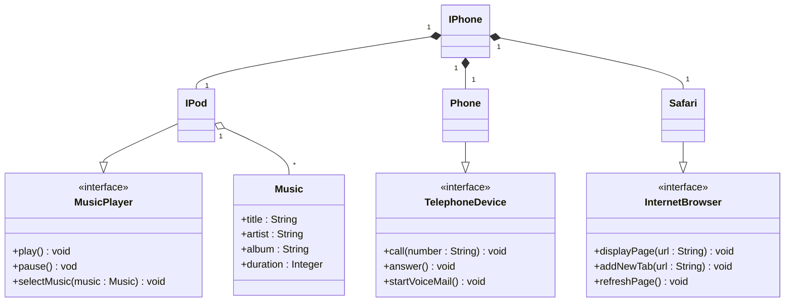

# DIO Lab POO iPhone

## Desafio
O desafio proposto se encontra no seguinte link: <a href="https://github.com/digitalinnovationone/trilha-java-basico/tree/main/desafios/poo" target="_blank">digitalinnovationone/trilha-java-basico</a>

### Diagrama de Classes

